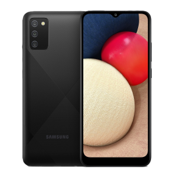
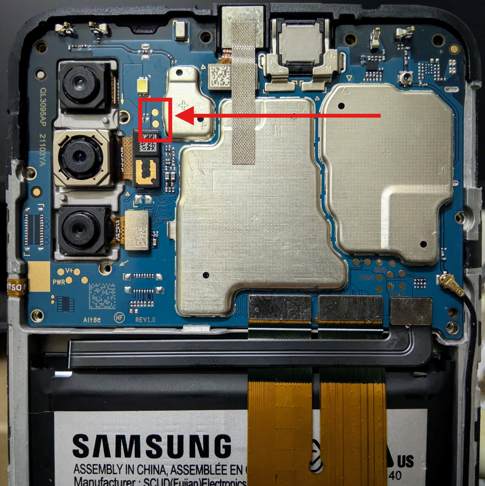
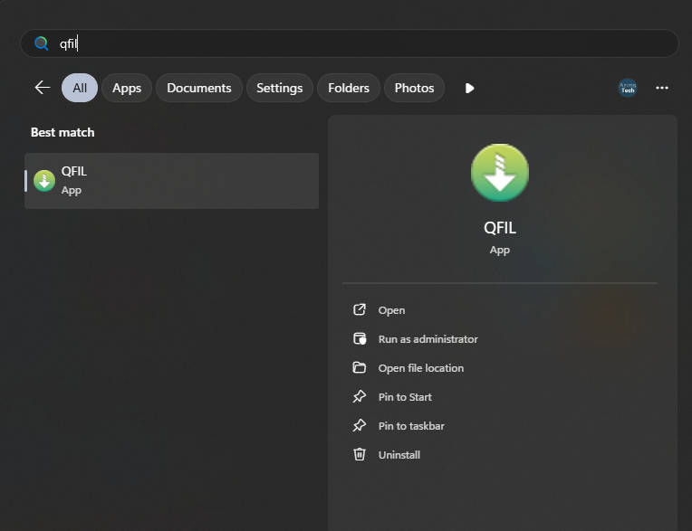

# Bypassing FRP on Samsung A02s (EDL Method)

 

> [!WARNING]
> **Disclaimer:** Use these steps only on devices you own. Unauthorized bypassing of security features is illegal.

> [!TIP]
> Do a factory reset if you haven't already.

# Downloads
- [prog_emmc_firehose_8953_ddr.mbn](./prog_emmc_firehose_8953_ddr.mbn)
- [QPST (Qualcomm Product Support Tool)](../../Tools/QPST_2.7.473.zip)
- [QDLoader HS-USB Driver](./QHSUSB_Drivers.7z)
# Step by Step

1. **Entering EDL mode**
    - Turn off & disamssamble back cover
    - Unscrew black plastic cover on top of the mainboard
    - Short two pins near camera module:  
      
    - Plung the phone to the computer while shorting those two pin
    - Extract and Install the QDLoader HS-USB Driver

2. **Erasing FRP**
    - Download and install **QPST**
    - Search and Run QFIL  
      
    - Follow video below:  
    
    - Your phone will reboot

> [!NOTE]
> Tested on Samsung Galaxy A02s Android 12 (17 Nov 2025)