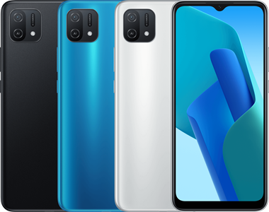

# FRP Bypass for Oppo A16K (Clone Phone Method)

 

> [!WARNING]
> **Disclaimer:** Use these steps only on devices you own. Unauthorized bypassing of security features is illegal.

## What You Need
- Two phones
- Wi-Fi connection

---

## Steps

**1. Enable TalkBack**
- Connect to Wi-Fi
- Hold **Volume Up + Volume Down** while turning on

**2. Open Settings**
- Hold **Volume Up + Volume Down** again
- Draw flipped "L" shape (left to right, then up) for voice commands
    ```console
             ↑
             |
             |
             |
    →________|

    ```
- Say **"Open Google Assistant"**
- Tap **⌨️** → Type **"Open Settings"**

**3. Launch Clone Phone**
- **Settings → Home screen & Lock screen → Home screen layout**
- Open **Clone Phone** app from home screen

**4. Transfer Data**
- Tap **Agree → New phone → Import from Android**
- On second phone: Install **Clone Phone** → Scan QR code
- Complete transfer process

**5. Finish**
- FRP lock removed, Safe to Factory reset the device

---

> [!NOTE]
> Tested on Oppo A16K CPH2349 (6 Feb 2025)
