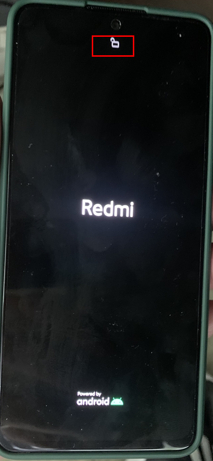
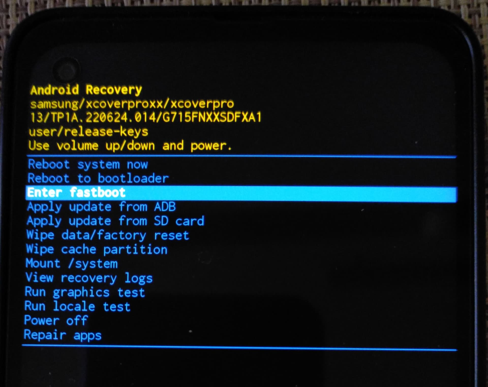

# Bypassing FRP on Redmi A5 (Unisoc Bootloader Exploit)

 

> [!WARNING]
> **Disclaimer:** Use these steps only on devices you own. Unauthorized bypassing of security features is illegal.

# Downloads
- Unisoc Driver – [SPRD-NPI-USBDriver-1.4.zip](../../Drivers/SPRD-NPI-USBDriver-1.4.zip)
- Bootloader Unlock Exploit – [ums9230e_Tecno_KL4.zip](https://github.com/TomKing062/CVE-2022-38694_unlock_bootloader/releases/tag/1.72)
- ADB & Fastboot – `winget install Google.PlatformTools`

# Step by Step

1. **Unlocking Bootloader**
    - Extract and install the driver
    - Turn off the phone
    - Extract **ums9230e_Tecno_KL4.zip** and run **unlock_autopatch_9230.bat**
    - Pung the phone to the computer while holding volume down
    - Follow the instruction on the screen
    - If everything done correctly it should reboot the phone automatically
    - See unlock symbol that means bootloader has been unlocked. If not, redo step 1 again.  
    

2. **Entering fastboot**
    - Turn off the phone
    - Hold volume up and power button.
    - Only release power button when "MI" logo showed up.
    - Recovery mode should look like this:   
    
    - Chooose enter fastboot with volume and power button
2. **Wiping Data and Removing FRP**
    - Run Windows terminal and enter this command below:  
    `fastboot erase userdata`  
    `fastboot erase metadata`  
    `fastboot erase persist`  
    - Now reboot 
2. **Locking Bottloader**
    - Settings ➡️ About phone ➡️ Tap "Build number" 7 times
    - Go back ➡️ System ➡️ Developer options ➡️ switch on USB debugging
    - Connect phone to computer and allow it on the phone.
    - Run this command in Windows Terminal: `adb reboot fastboot`
    - In fastboot mode run: `fastboot oem lock`

> [!NOTE]
> Tested on Redmi A5 Android Go 15 (10 Nov 2025)
