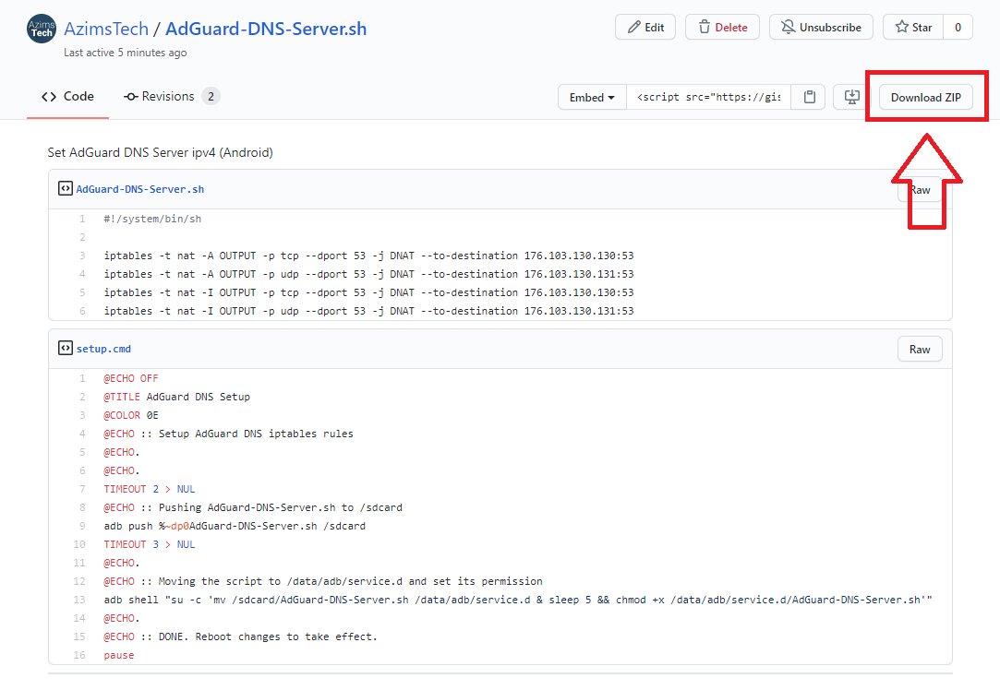

# Contents
- [Option 1: Unified Hosts](#unified-hosts)
- [Option 2: AdGuard DNS](#adguard-dns)

## Option 1: Unified Hosts
Block Android OEMs data collection + ads with [Steven Black's Unified Hosts.](https://github.com/StevenBlack/hosts)

### AdAway Setup:
1. Install the [latest version](https://androidfilehost.com/?w=files&flid=249276&sort_by=date&sort_dir=DESC) of AdAway.
2. Inside  adaway app, **Preferences** >> **Enable systemless mode** >> **Reboot**
3. Open  adaway app, **Preferences** >> **Redirection IPv4** >> Change the value to [0.0.0.0](https://github.com/StevenBlack/hosts#we-recommend-using-0000-instead-of-127001)
4.  Go to >> **Hosts sources** >> replace existing url with: `https://raw.githubusercontent.com/StevenBlack/hosts/master/hosts` 

5. **Home** >> **ENABLE AD-BLOCKING** >> reboot required for change to take effect

### Additional Notes
- Skip step 2 if you aren't using Magisk.

## Option 2: AdGuard DNS

### What is AdGuard DNS?
  AdGuard DNS is a free, privacy-oriented DNS resolution system that blocks tracking, ads and phishing. [More information here.](https://adguard.com/en/adguard-dns/overview.html)

### Setup AdGurad DNS server by iptables rules manually
1. Make a new shell script file `.sh` containing this script:
~~~
#!/system/bin/sh

iptables -t nat -A OUTPUT -p tcp --dport 53 -j DNAT --to-destination 176.103.130.130:53
iptables -t nat -A OUTPUT -p udp --dport 53 -j DNAT --to-destination 176.103.130.131:53
iptables -t nat -I OUTPUT -p tcp --dport 53 -j DNAT --to-destination 176.103.130.130:53
iptables -t nat -I OUTPUT -p udp --dport 53 -j DNAT --to-destination 176.103.130.131:53
~~~

2. Place the script file into `/data/adb/service.d` and set `755` as **permissions**. 

3. **Reboot** changes to take effect.

### Automated method from ADB
or you can just **download** it from here: https://gist.github.com/AzimsTech/c20512b2b15763bc2677a9426266e281 and **run** `setup.cmd` you can **skip** all steps from here

### Additional Notes
- Requires Magisk
- An automated method requires adb for your pc

# Research 
- [StevenBlack/hosts](https://github.com/StevenBlack/hosts)
- [AdAway xda thread](https://forum.xda-developers.com/showthread.php?t=2190753)
- [AdGuard DNS - official website](https://adguard.com/en/adguard-dns/overview.html)
- [IPTables Basics - Afwall wiki](https://github.com/ukanth/afwall/wiki/IPtables#basics)
- [Magisk Developer Guides](https://topjohnwu.github.io/Magisk/guides.html)
